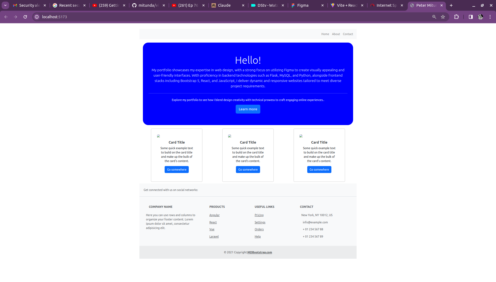

# My Portfolio

- Welcome to my personal portfolio website, showcasing my skills, projects, and experience. This portfolio is built using React.js, a popular JavaScript library for building user interfaces, and Bootstrap, a widely-used CSS framework for responsive web design.

## Table of Contents

- [Features](#features)
- [Technologies Used](#technologies-used)
- [Layout](#layout)
- [Installation](#installation)
- [Usage](#usage)
- [Contributing](#contributing)
- [License](#license)

## Features

- **Project Showcase**: The portfolio features a dedicated section to showcase my projects, including detailed descriptions, screenshots, and live demos (where applicable).
- **About Me**: Get to know me better through a personal bio and information about my background, skills, and interests.
- **Contact Form**: Visitors can easily get in touch with me through a user-friendly contact form.
- **Responsive Design**: The portfolio is designed to provide an optimal viewing experience across various devices and screen sizes, thanks to Bootstrap's responsive grid system.

## Technologies Used

- React.js
- Bootstrap
- HTML5
- CSS3
- JavaScript

## Layout

## Installation

To run this project locally, follow these steps:

1. Clone the repository: `git clone https://github.com/your-username/your-portfolio.git`
2. Navigate to the project directory: `cd your-portfolio`
3. Install dependencies: `npm install`
4. Start the development server: `npm start`

The application should now be running on `http://localhost:3000`.

## Usage

Once the development server is running, you can explore the portfolio by navigating through the different sections using the provided navigation menu. You can view project details, learn more about me, and submit a contact form.

## Contributing

Contributions are welcome! If you find any issues or have suggestions for improvements, please open an issue or submit a pull request. Follow these steps to contribute:

1. Fork the repository
2. Create a new branch: `git checkout -b my-feature-branch`
3. Make your changes and commit them: `git commit -m 'Add my feature'`
4. Push to the branch: `git push origin my-feature-branch`
5. Submit a pull request

## License

This project is licensed under the [MIT License](LICENSE).